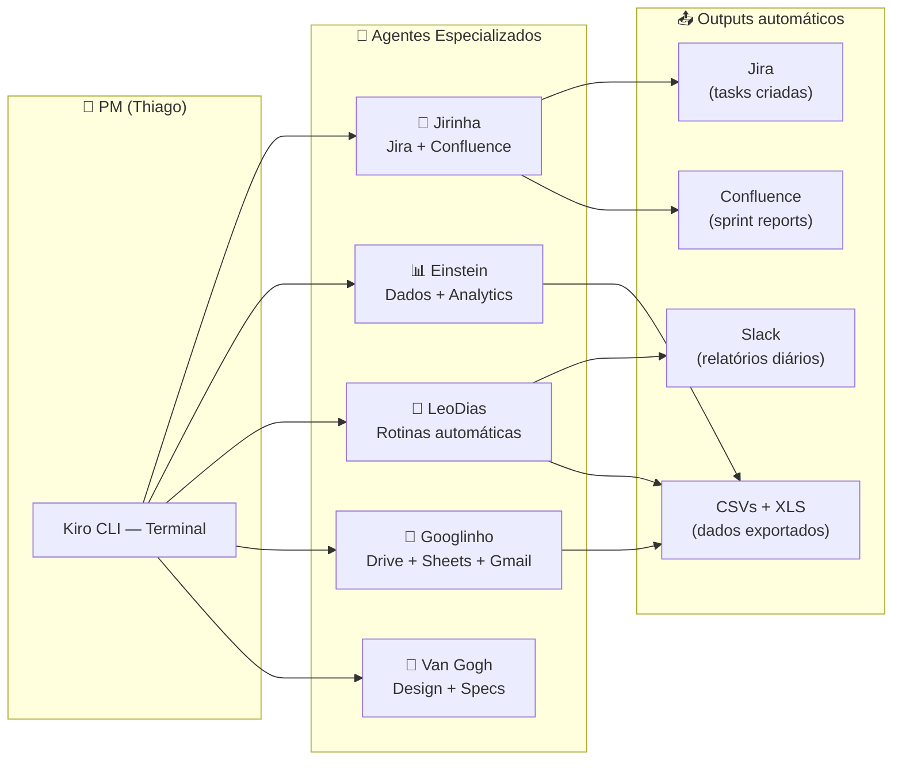

# Material para Café de IA — Reunião com Diretora de Produto
> Preparado em: 24/07/2026 | Apresentação: 31/07/2026

---

## 1. Diagrama do Ecossistema de Agentes (versão apresentação)



**Como explicar:** "Eu converso em linguagem natural pelo terminal. Cada agente é especialista em um domínio. Eles se conectam às ferramentas que já usamos (Jira, Confluence, bancos de dados, Slack) e executam tarefas que antes eram manuais."

---

## 2. Script de Demo — 3 Cenários ao Vivo

### Demo 1: Criar tasks no Jira por linguagem natural (~2 min)

**Setup:** Ter o Kiro CLI aberto no terminal.

**Roteiro:**
```
EU DIGO:
"Criar 2 tasks no Jira:
Título: Rollout - Hv One
Plataforma: Android / iOS
Descrição: Fazer rollout do teste Hv One para 100%
Critério de Aceite: Feature flag em 100% para todos os usuários
Quarter: Q32026
Stack: ANDROID, IOS
Classificação: Mapa Estratégico
Sprint: Sprint 24"

O QUE ACONTECE:
→ O agente identifica 2 plataformas → cria 2 tasks separadas
→ Prefixo automático: [Android] e [iOS]
→ Labels formatados: Q32026, Mapa_Estratégico, ANDROID/IOS
→ Me mostra preview antes de criar
→ Após confirmar: 2 issues criadas no Jira com link
```

**Ponto-chave para a audiência:** "Eu descrevo o que quero, o agente sabe o template do time, formata, valida e cria. Não preciso abrir o Jira, preencher campos, nem lembrar dos labels."

---

### Demo 2: Consulta analítica em banco de dados (~2 min)

**Setup:** VPN conectada.

**Roteiro:**
```
EU DIGO:
"Einstein, quantos históricos veiculares foram gerados ontem?
Compara com a média dos últimos 7 dias.
Tem algum provider com volume anormal?"

O QUE ACONTECE:
→ O agente monta a query SQL automaticamente
→ Executa contra o banco PostgreSQL (vehicle_history_production)
→ Retorna: "Ontem: 46.614 consultas. Média 7 dias: 44.800. +4% ✓
   Nenhum provider com desvio >10%."
```

**Ponto-chave:** "Eu não preciso lembrar nome de tabela, nem escrever SQL. Faço a pergunta de produto e recebo a resposta de produto."

---

### Demo 3: Relatório que roda sozinho + notificação no Slack (~1 min)

**Setup:** Mostrar o canal #leo-dias-news no Slack com mensagens recentes.

**Roteiro:**
```
MOSTRO:
→ Canal do Slack com relatório de hoje (24/07) postado às 08:49
→ Conteúdo: "📊 Vehicle History Report — 46.614 consultas"
→ CSV anexo com breakdown por provider

EXPLICO:
"Esse relatório roda todo dia automaticamente. Puxa dados do banco,
gera CSV, posta no Slack e me manda DM. Se a VPN estiver desconectada,
ele me avisa em vez de falhar silenciosamente."
```

**Ponto-chave:** "Meu tempo gasto nisso: zero. Antes eu abria o banco, rodava query, formatava planilha, mandava no canal. Eram ~15 min/dia."

---

## 3. Métricas das Rotinas Automatizadas

| Rotina | Frequência | Output | Tempo manual estimado | Economia/mês |
|--------|-----------|--------|----------------------|--------------|
| **Relatório diário veículos** | 2x/dia (12h + 18h) | CSV + Slack | ~15 min/execução | **~10h/mês** |
| **Report semanal safra** | Seg 10h30 | CSV + Slack | ~30 min | **~2h/mês** |
| **Report semanal VAS** | Seg 10h30 | CSV + Slack | ~30 min | **~2h/mês** |
| **Sprint watcher** | 2x/dia (9h + 17h) | Confluence + Slack | ~45 min (ao final da sprint) | **~1.5h/mês** |
| **Relatório suportes** | Diário 11h | Confluence | ~20 min | **~7h/mês** |
| **Atualização B3 veículos** | Dia 15/mês | PDFs + Knowledge Base | ~1h | **~1h/mês** |
| **Backup Brain → Drive** | Diário 10h30 | Google Drive | ~5 min | **~1.5h/mês** |
| **Criação batch de tasks** | Sob demanda (~3x/sprint) | Jira issues | ~20 min/batch | **~2h/mês** |
| **Consultas analíticas** | Sob demanda (~5x/semana) | Dados estruturados | ~10 min/consulta | **~3.5h/mês** |

### Resumo

| Métrica | Valor |
|---------|-------|
| **Total de rotinas automatizadas** | 7 scripts em cron + 2 sob demanda |
| **Execuções automáticas/semana** | ~24 (sem intervenção humana) |
| **Economia mensal estimada** | **~30 horas** |
| **Tempo de setup (1 vez)** | ~3 semanas (iterando, testando, corrigindo) |
| **Payback** | Desde o 2º mês |

---

## 4. O que NÃO funcionou / Limitações

### ❌ Migração de path quebrou rotinas por semanas
- **O que aconteceu:** Mudei a pasta do projeto (`Brain-KIRO` → `Documents/Main/Brain`) mas o cron ainda apontava para o path antigo.
- **Impacto:** Weekly safra e sprint watcher falharam silenciosamente por 3+ semanas.
- **Lição:** Automação precisa de health check. Hoje tenho monitoramento via Slack — se a rotina não posta, algo está errado.

### ❌ VPN é um single point of failure
- **O que aconteceu:** Qualquer rotina que depende de banco interno falha se a VPN desconecta.
- **Impacto:** Relatórios não gerados quando o Mac está em sleep ou a sessão VPN cai.
- **Status:** Parcialmente resolvido com check de VPN antes de executar, mas não é 100%.

### ❌ Agente "alucina" em tasks não-estruturadas
- **O que aconteceu:** Quando peço algo vago ("organiza o backlog"), o agente toma decisões que não fazem sentido para o contexto do time.
- **Lição:** IA funciona bem quando o input é estruturado (templates, decision points). Funciona mal quando precisa de julgamento de produto.

### ❌ Custo cognitivo inicial é alto
- **O que aconteceu:** Configurar agentes, bridges, credenciais, testar fluxos, documentar padrões — levou tempo significativo.
- **Lição:** Não é "plug and play". Precisa de alguém com perfil técnico e paciência pra iterar.

### ❌ Dependência de formato exato nas APIs
- **O que aconteceu:** Workflow do Jira exige transições em ordem específica. Labels precisam de underscore. Sprint precisa existir.
- **Impacto:** O agente falha se não souber a sequência. Precisei documentar exceções.
- **Lição:** Memória operacional (erros documentados) é essencial. Sem ela, o agente repete os mesmos erros.

### ⚠️ Limitações que permanecem
- Não substitui decisão de produto — é ferramenta, não PM
- Não funciona offline (depende de APIs externas)
- Context window tem limite — análises muito longas precisam ser fatiadas
- Output precisa de curadoria humana antes de compartilhar externamente

---

## 5. Perguntas para Provocar o Debate

1. **"Quem mais no time gasta tempo com tarefas repetitivas que poderiam ser automatizadas?"**
2. **"Se pudéssemos ter UM agente compartilhado na área de produto, qual seria o mais útil?"**
3. **"O que nos impede de padronizar? Falta de ferramenta ou falta de processo?"**
4. **"Qual o nível de conforto do time com IA tendo acesso de escrita (criar tasks, publicar no Confluence)?"**

---

## Notas para a apresentação

- **Tom:** prático e honesto. Mostrar resultados reais, incluindo falhas.
- **Duração:** ~10 min de show + resto é debate.
- **Não levar:** slides bonitos. O material é o terminal + Slack + Jira abertos.
- **Levar:** este doc no celular como cola, terminal pronto para demo.
