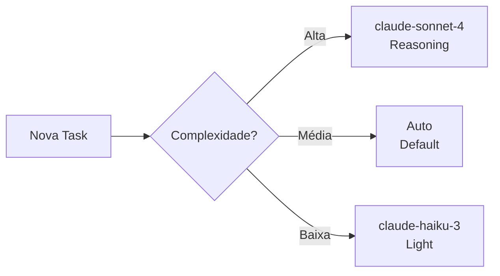
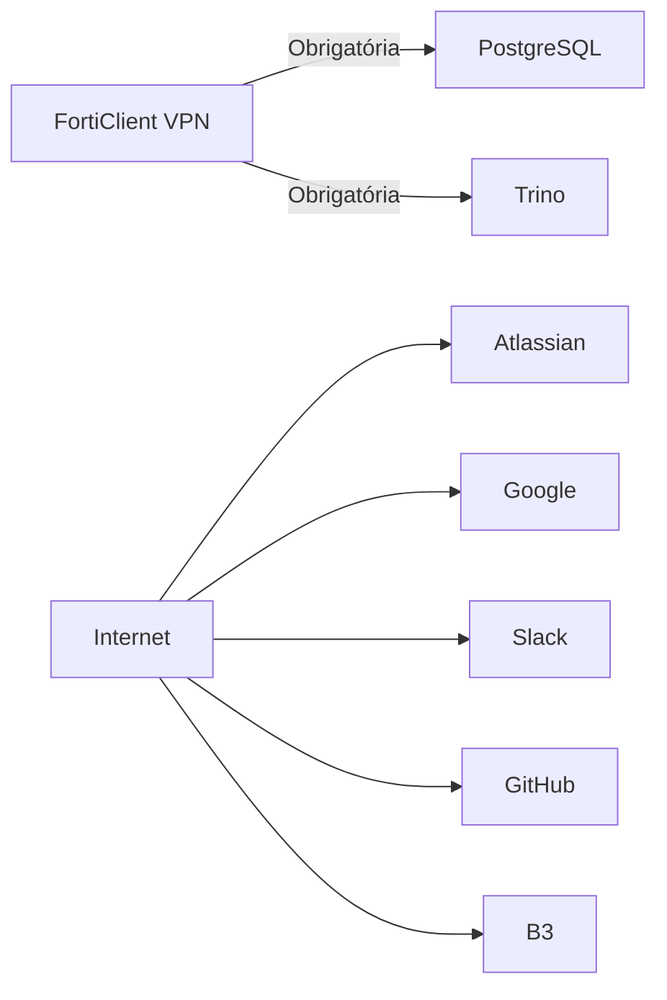

# Stack VAS — Esquema Visual

```mermaid
graph TB
    %% ═══════════════════════════════════════════
    %% CAMADA DE INTERFACE
    %% ═══════════════════════════════════════════
    subgraph INTERFACE["🖥️ Interface — Kiro CLI"]
        KIRO[Kiro CLI<br/>Terminal macOS]
        RTK[RTK<br/>Token Optimizer]
    end

    %% ═══════════════════════════════════════════
    %% CAMADA DE AGENTES
    %% ═══════════════════════════════════════════
    subgraph AGENTS["🤖 Agentes Especializados"]
        JIRINHA[🎫 Jirinha<br/>Jira + Confluence]
        EINSTEIN[📊 Einstein<br/>Dados + Analytics]
        LEODIAS[📰 LeoDias<br/>Rotinas + Notificações]
        GOOGLINHO[📁 Googlinho<br/>Drive + Sheets + Gmail]
        VANGOGH[🎨 Van Gogh<br/>Design + Specs]
        GITHUB[🐙 GitHub<br/>PRs + Repos]
    end

    %% ═══════════════════════════════════════════
    %% CAMADA DE BRIDGES (MCP)
    %% ═══════════════════════════════════════════
    subgraph BRIDGES["🌉 Bridges MCP (JSON-RPC)"]
        B_ATLASSIAN[atlassian_bridge.py]
        B_POSTGRES[postgres_bridge.py]
        B_TRINO[trino_mcp_bridge.py]
        B_GOOGLE[google_bridge.py]
        B_SLACK[slack_bridge.py]
    end

    %% ═══════════════════════════════════════════
    %% CAMADA DE ROTINAS
    %% ═══════════════════════════════════════════
    subgraph ROUTINES["⏰ Rotinas Automatizadas (cron)"]
        R_VEHICLE[daily_vehicle_report.py<br/>12h + 18h]
        R_SAFRA[weekly_safra_rejected_report.py<br/>Seg 10h30]
        R_VAS[weekly_vas_report.py<br/>Seg 10h30]
        R_SPRINT[sprint_confluence_watcher.py<br/>9h + 17h]
        R_SUPPORT[daily_support_report.py<br/>11h]
        R_B3[b3_veiculos_updater.py<br/>Dia 15 10h]
        R_BACKUP[daily_brain_backup_drive.py<br/>10h30]
    end

    %% ═══════════════════════════════════════════
    %% CAMADA DE DADOS
    %% ═══════════════════════════════════════════
    subgraph DATA["🗄️ Bancos de Dados"]
        PG_VAS[(PostgreSQL<br/>advertising_vas<br/>[INTERNAL_HOST_DEFAULT])]
        PG_HV[(PostgreSQL<br/>vehicle_history_production<br/>[INTERNAL_HOST_VEHICLE])]
        TRINO[(Trino/Hive<br/>Catalog: hive / Schema: ods<br/>[TRINO_GATEWAY_HOST])]
    end

    %% ═══════════════════════════════════════════
    %% SERVIÇOS EXTERNOS
    %% ═══════════════════════════════════════════
    subgraph EXTERNAL["☁️ Serviços Externos"]
        JIRA_API[Atlassian Cloud<br/>[YOUR_ATLASSIAN_DOMAIN]]
        GOOGLE_API[Google Workspace<br/>Drive · Sheets · Slides · Gmail]
        SLACK_API[Slack API<br/>Canal: leo-dias-news]
        GH_API[GitHub API]
        B3_WEB[B3 Website<br/>Dados Financiamento Veículos]
    end

    %% ═══════════════════════════════════════════
    %% STORAGE LOCAL
    %% ═══════════════════════════════════════════
    subgraph LOCAL["💾 Storage Local"]
        BRAIN[Brain/<br/>Agents · Bridges · Rotines<br/>Steering · Errors · Prompts]
        KB[Knowledge Base<br/>B3 Financiamentos Veículos]
        REPORTS[~/Documents/<br/>Vehicle Reports · Safra Reports]
        STEERING[.kiro/steering/<br/>Configurações dos agentes]
    end

    %% ═══════════════════════════════════════════
    %% CONEXÕES
    %% ═══════════════════════════════════════════

    %% Interface → Agentes
    KIRO --> JIRINHA
    KIRO --> EINSTEIN
    KIRO --> LEODIAS
    KIRO --> GOOGLINHO
    KIRO --> VANGOGH
    KIRO --> GITHUB
    KIRO --> RTK

    %% Agentes → Bridges
    JIRINHA --> B_ATLASSIAN
    EINSTEIN --> B_POSTGRES
    EINSTEIN --> B_TRINO
    GOOGLINHO --> B_GOOGLE
    LEODIAS --> B_SLACK
    LEODIAS --> B_POSTGRES

    %% Bridges → Serviços
    B_ATLASSIAN --> JIRA_API
    B_POSTGRES --> PG_VAS
    B_POSTGRES --> PG_HV
    B_TRINO --> TRINO
    B_GOOGLE --> GOOGLE_API
    B_SLACK --> SLACK_API
    GITHUB --> GH_API

    %% Rotinas → Bridges/Serviços
    R_VEHICLE --> B_POSTGRES
    R_VEHICLE --> B_SLACK
    R_SAFRA --> B_POSTGRES
    R_SAFRA --> B_SLACK
    R_VAS --> B_POSTGRES
    R_VAS --> B_SLACK
    R_SPRINT --> B_ATLASSIAN
    R_SPRINT --> B_SLACK
    R_SUPPORT --> B_ATLASSIAN
    R_B3 --> B3_WEB
    R_B3 --> KB
    R_BACKUP --> B_GOOGLE

    %% Storage
    LEODIAS --> REPORTS
    R_BACKUP --> BRAIN
    KIRO --> STEERING

    %% Estilos
    classDef interface fill:#1a1a2e,stroke:#16213e,color:#e94560
    classDef agent fill:#0f3460,stroke:#533483,color:#e94560
    classDef bridge fill:#533483,stroke:#e94560,color:#fff
    classDef data fill:#16213e,stroke:#0f3460,color:#00d2d3
    classDef external fill:#2d3436,stroke:#636e72,color:#74b9ff
    classDef routine fill:#2d3436,stroke:#00b894,color:#55efc4
    classDef local fill:#2d3436,stroke:#fdcb6e,color:#ffeaa7

    class KIRO,RTK interface
    class JIRINHA,EINSTEIN,LEODIAS,GOOGLINHO,VANGOGH,GITHUB agent
    class B_ATLASSIAN,B_POSTGRES,B_TRINO,B_GOOGLE,B_SLACK bridge
    class PG_VAS,PG_HV,TRINO data
    class JIRA_API,GOOGLE_API,SLACK_API,GH_API,B3_WEB external
    class R_VEHICLE,R_SAFRA,R_VAS,R_SPRINT,R_SUPPORT,R_B3,R_BACKUP routine
    class BRAIN,KB,REPORTS,STEERING local
```

## Resumo da Arquitetura

| Camada | Componentes | Função |
|--------|-------------|--------|
| **Interface** | Kiro CLI + RTK | Entrada do usuário, otimização de tokens |
| **Agentes** | Jirinha, Einstein, LeoDias, Googlinho, Van Gogh, GitHub | Especialistas por domínio |
| **Bridges** | 5 bridges MCP (JSON-RPC via stdin/stdout) | Abstração de comunicação com APIs |
| **Rotinas** | 7 scripts cron | Automação periódica sem intervenção |
| **Dados** | 2× PostgreSQL + Trino/Hive | Bancos operacionais + data lake |
| **Externos** | Atlassian, Google, Slack, GitHub, B3 | Serviços cloud integrados |
| **Storage** | Brain/ + .kiro/ + Knowledge Bases | Memória persistente e configuração |

## Fluxo de Decisão de Modelo



## Rede de Comunicação


